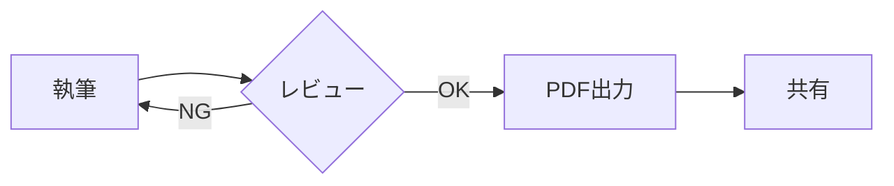
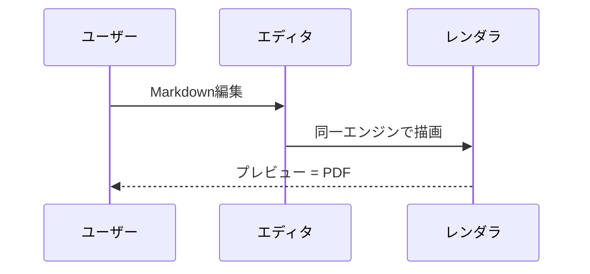

# PDF出力 忠実性テスト

このドキュメントはプレビューとPDF出力の一致を目視確認するためのサンプルです。

## 1. テーブル

| 項目 | 説明 | 状態 |
| --- | --- | --- |
| WYSIWYGテーブル編集 | セルを直接編集、行・列をGUIで追加/削除 | ✅ |
| Mermaid図 | コードブロックを即時レンダリング | ✅ |
| PDF出力 | プレビューと同一レンダラで出力 | ✅ |
| 日本語 | 禁則処理・フォントの確認 | ✅ |

## 2. Mermaid フローチャート



## 3. Mermaid シーケンス図



## 4. 数式

質量とエネルギーの等価性: $E = mc^2$

$$
f(x) = \frac{1}{\sigma\sqrt{2\pi}} e^{-\frac{(x-\mu)^2}{2\sigma^2}}
$$

## 5. コードブロック

```typescript
export async function exportPdf(markdown: string): Promise<void> {
  // プレビューと同じレンダラで描画してから印刷する
  const dispose = await renderStatic(markdown, printRoot());
  window.print();
}
```

## 6. 引用とリスト

> 出力されたPDFがプレビューと一致しないなら、それはWYSIWYGではない。

1. 番号付きリスト
2. 二番目の項目
   - ネストした箇条書き
   - もう一つ
3. 三番目

- [x] タスクリスト(完了)
- [ ] タスクリスト(未完了)

## 7. 長い段落(改ページ確認用)

吾輩は猫である。名前はまだ無い。どこで生れたかとんと見当がつかぬ。何でも薄暗いじめじめした所でニャーニャー泣いていた事だけは記憶している。吾輩はここで始めて人間というものを見た。しかもあとで聞くとそれは書生という人間中で一番獰悪な種族であったそうだ。この書生というのは時々我々を捕えて煮て食うという話である。しかしその当時は何という考もなかったから別段恐しいとも思わなかった。

---

以上。PDFボタンで出力し、プレビューとの一致を確認してください。
